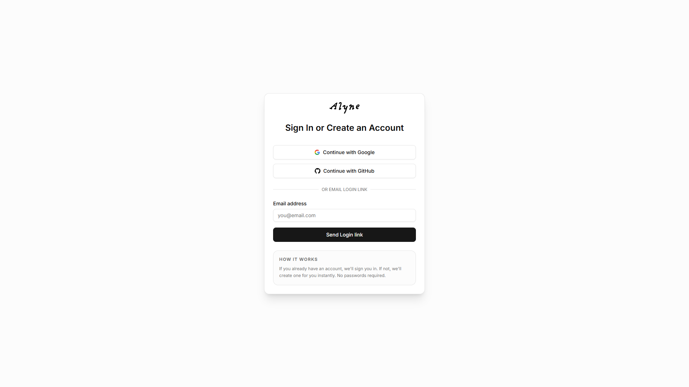
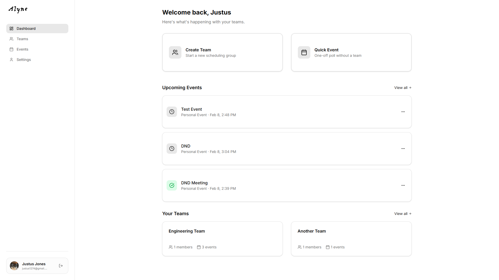
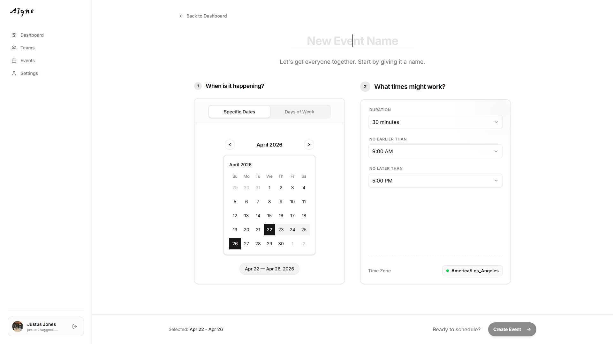
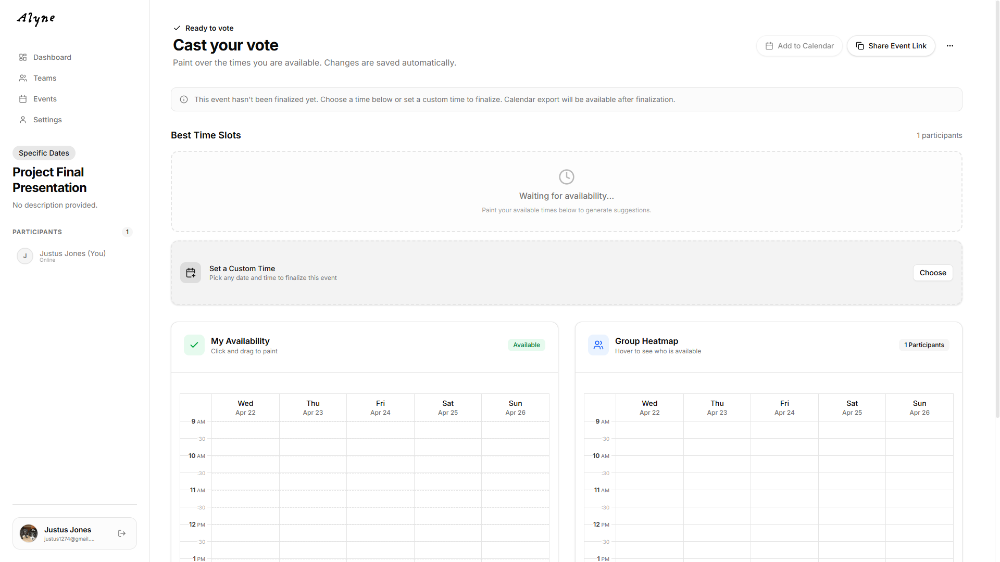
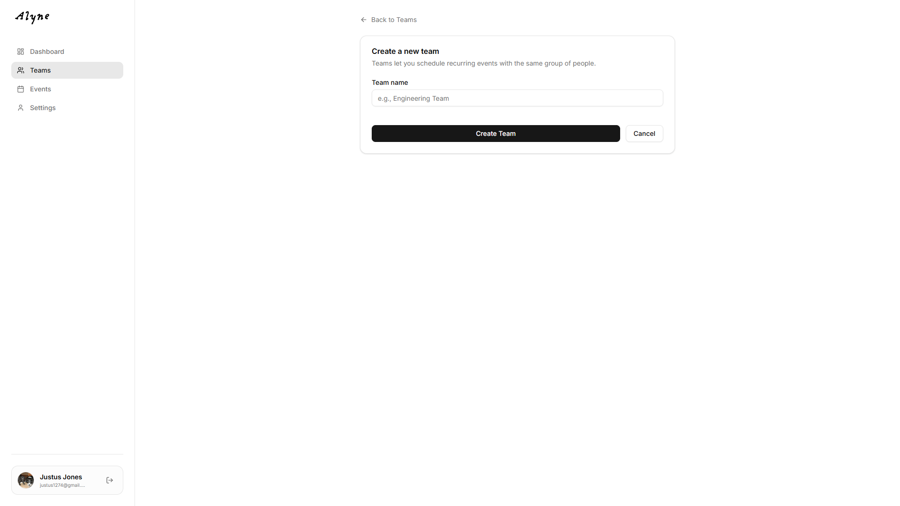
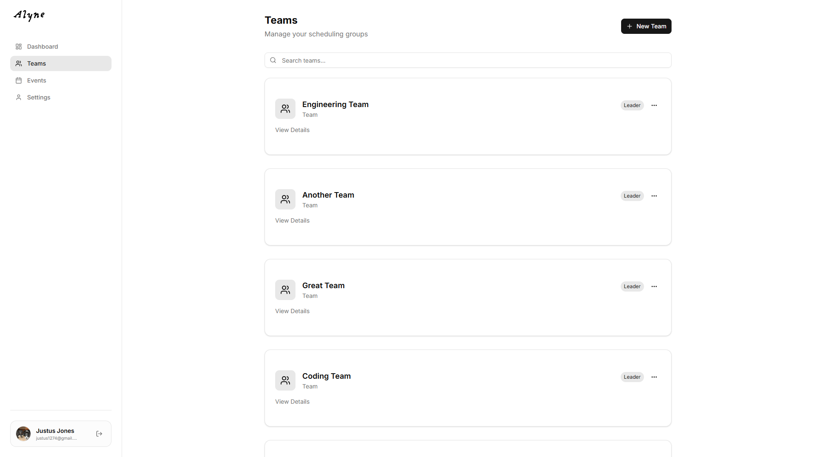
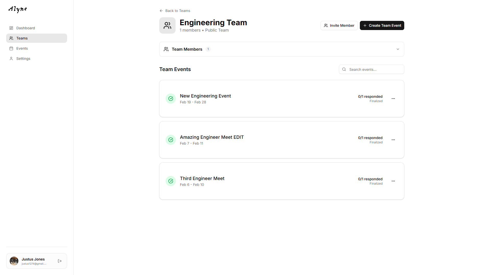
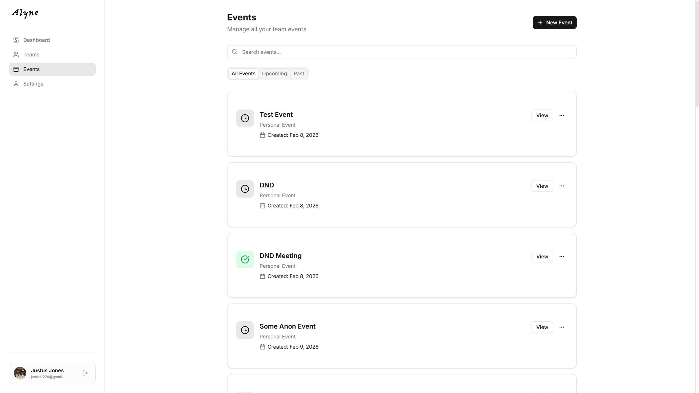
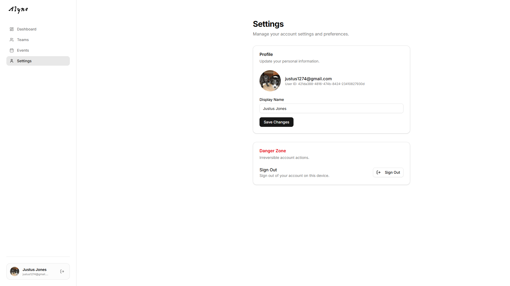

# Alyne — Project Final Report

**CPTS 489 · Web Application Development**
**Team Members:** _Justus Jones, Christian Iverson_

---

## Table of Contents

1. [Application Overview](#application-overview)
2. [Section 1 — MVC Implementation Walkthrough](#section-1--mvc-implementation-walkthrough)
3. [Section 2 — Route / API Table](#section-2--route--api-table)
4. [Section 3 — Data Model / ER Diagram](#section-3--data-model--er-diagram)
5. [Section 4 — Known Issues and Limitations](#section-4--known-issues-and-limitations)

---

## Application Overview

**Alyne** is a modern team scheduling and event-planning web application that solves the "when are we all free?" problem. Users can create events with interactive availability grids, form teams, invite members via shareable links, and collaboratively find the best meeting time — all without needing a traditional account and password.

### Technology Stack

| Layer | Technology |
|---|---|
| Frontend | React 19, TypeScript, Vite, Tailwind CSS v4, Radix UI, Lucide icons |
| Backend | Node.js, Express, TypeScript |
| Database | PostgreSQL (hosted on Supabase) |
| Authentication | Supabase Auth (Google OAuth, GitHub OAuth, email magic link) |
| Deployment | Vercel (frontend + serverless API) |

### User Roles

Alyne supports three modes of interaction, each with different capabilities:

| Role | Description |
|---|---|
| **Anonymous Guest** | Can create "quick events" without signing up, submit availability using only a name, and view shared event pages. |
| **Authenticated User** | Full access: create events (specific-date or recurring), manage teams, submit availability linked to their profile, edit/delete own events, update profile settings. |
| **Team Admin** | An authenticated user who created a team. Can share invite links and manage team details in addition to all regular user capabilities. |

---

## Section 1 — MVC Implementation Walkthrough

This section walks through the major use cases of the application, showing how the Route, Controller logic, Models, and Views work together for each flow.

> **Note on architecture:** Alyne uses a decoupled SPA architecture. The **frontend** (React) handles all rendering and routing (the "View" and client-side "Controller"), while the **backend** (Express) serves as a REST API (the server-side "Controller" and "Model" layer). The React frontend calls the Express API, which performs business logic and interacts with the PostgreSQL database through the Supabase client library. There are no server-rendered templates (like EJS); all views are React components.

---

### Use Case 1: User Signs In

#### 1. The Route (Client-Side)

**File:** `frontend/src/App.tsx`

When a user navigates to `/login`, React Router renders the `LoginPage` component. This is a public route — no authentication check is performed before displaying it.

#### 2. The Controller Logic

**File:** `frontend/src/pages/LoginPage.tsx`

The `LoginPage` component serves as both the view and client-side controller for authentication. It provides three sign-in options:

1. **Google OAuth** — Calls `supabase.auth.signInWithOAuth({ provider: 'google' })`, which redirects the browser to Google's consent screen and back.
2. **GitHub OAuth** — Same flow using `provider: 'github'`.
3. **Email Magic Link** — Calls `supabase.auth.signInWithOtp({ email })`, which sends a one-time login link to the user's inbox. No password is ever stored.

After successful authentication, Supabase sets a session token in local storage. The `AuthProvider` component (see below) detects the new session and updates the global auth context.

**File:** `frontend/src/components/AuthProvider.tsx`

The `AuthProvider` wraps the entire application. On mount, it calls `supabase.auth.getSession()` to restore any existing session and subscribes to `onAuthStateChange` to react to future login/logout events. It provides `{ user, session, loading }` to all child components via React Context.

#### 3. The Models

| Model | Operation | What Happens |
|---|---|---|
| Supabase Auth (Users) | Read / Create | Supabase Auth handles user lookup or automatic account creation. If the email or OAuth identity is new, a user record is created in Supabase's `auth.users` table automatically. |

#### 4. The Views

**View 1 — Login Page** (`frontend/src/pages/LoginPage.tsx`)

This page displays a centered card with the Alyne logo, Google and GitHub sign-in buttons, a separator, and an email input form for magic link login. A message area shows either success ("Check your email for the login link!") or error messages.

_Annotate: Google OAuth button, GitHub OAuth button, email input field, Send Login Link button_

**View 2 — Dashboard (post-login redirect)** (`frontend/src/pages/DashboardPage.tsx`)

After login, users are redirected to `/dashboard` (or the page they were originally trying to access via the `?redirect=` query parameter). The dashboard shows a welcome message, upcoming events, and the user's teams.

_Annotate: user greeting, upcoming events section, teams section, "New Event" button_

---

### Use Case 2: User Creates an Event

#### 1. The Route

**Client-side:** React Router renders `CreateEventPage` at `/create` (public) or `/events/new` (authenticated).

**Server-side:** `POST /api/events` — defined in `backend/src/routes/events.ts` and mounted in `backend/src/app.ts` via `app.use('/api/events', eventsRouter)`.

#### 2. The Controller Logic

**File (Frontend):** `frontend/src/pages/CreateEventPage.tsx` → `handleCreate()`

The `CreateEventPage` is a multi-step form. The controller logic proceeds as follows:

1. The user enters an event **title** and optional **description**.
2. The user selects a **timezone** from a dropdown (all IANA timezones are listed).
3. The user chooses the **event type**: "Specific Dates" or "Days of Week".
   - *Specific Dates:* A calendar date picker (powered by `react-day-picker`) lets the user select one or more dates. The user also sets start and end time bounds (e.g., 9:00 AM – 5:00 PM).
   - *Days of Week:* Toggle-buttons for each day of the week (Mon–Sun). Same start/end time configuration.
4. Optionally, the user can link the event to a **team** if they belong to any.
5. On form submission, the frontend sends a `POST /api/events` request with `{ title, description, timezone, event_type, configuration, user_id, team_id }`.

**File (Backend):** `backend/src/routes/events.ts` → `router.post('/')`

The server-side controller:
1. Validates that the Supabase admin client is initialized.
2. Inserts a new row into the `events` table with the provided fields. `created_by` is set to the user's ID (or `null` for anonymous events). `configuration` is stored as a JSON column containing the dates/days and time bounds.
3. Returns the newly created event record (with its generated UUID) as JSON with status `201 Created`.

#### 3. The Models

| Model | Operation | What Happens |
|---|---|---|
| Event | Create | A new event record is inserted with title, description, timezone, event type, configuration (JSON), created_by (user ID), and optional team_id. |

#### 4. The Views

**View 1 — Create Event Form** (`frontend/src/pages/CreateEventPage.tsx`)

A full-page form with step-by-step fields. The design adapts for both authenticated users (shows sidebar, team selector) and anonymous guests (standalone page with no sidebar).

_Annotate: title input, event type toggle (Specific Dates / Days of Week), calendar date picker, time range selectors, team dropdown (authenticated only), Create Event button_

**View 2 — Event Detail Page (redirect after creation)** (`frontend/src/pages/EventPage.tsx`)

After creation, the user is redirected to `/event/:id` where they can share the link and begin submitting their own availability.

_Annotate: event title, share link / copy button, interactive availability grid, participant list_

---

### Use Case 3: User Submits Availability for an Event

#### 1. The Route

**Client-side:** React Router renders `EventPage` at `/event/:id` (public route — anyone with the link can access).

**Server-side:** `POST /api/events/:id/participate` — defined in `backend/src/routes/events.ts`.

#### 2. The Controller Logic

**File (Frontend):** `frontend/src/pages/EventPage.tsx` → `handleSlotToggle()` and availability submission

1. The page fetches the event details via `GET /api/events/:id`, which returns the event configuration and all current participants with their availability data.
2. An **InteractiveGrid** component is rendered, where columns represent dates (or days of the week) and rows represent half-hour time slots within the configured time bounds.
3. The user **clicks or drags** on grid cells to toggle time slots as "available." The grid uses mouse event handlers (`handleMouseDown`, `handleMouseEnter`, `handleMouseUp`) to support paint-to-select behavior.
4. For anonymous users, the page prompts for a name before submitting.
5. On "Save Availability," the frontend sends `POST /api/events/:id/participate` with `{ name, email, availability (array of slot IDs), user_id }`.

**File (Backend):** `backend/src/routes/events.ts` → `router.post('/:id/participate')`

The server-side controller implements an **upsert** strategy:
1. If a `user_id` is provided, it checks for an existing participant record matching `(event_id, user_id)`. If found, it updates; otherwise, it checks if there's an anonymous record with the same name to "claim."
2. If only an `email` is provided, it matches by `(event_id, email)`.
3. If neither is provided (anonymous guest), it matches by `(event_id, name)` where `user_id IS NULL`.
4. Based on the lookup, the controller either **updates** the existing participant record or **inserts** a new one.
5. Returns the saved participant record.

#### 3. The Models

| Model | Operation | What Happens |
|---|---|---|
| Event | Read | The event record is fetched to render the grid configuration (dates, time range). |
| Participant | Read | All existing participants for this event are fetched to display the group heatmap. |
| Participant | Create or Update | The user's availability is either inserted as a new participant or updated if they already submitted. |

#### 4. The Views

**View — Event Page with Availability Grid** (`frontend/src/pages/EventPage.tsx`)

The event page has two main sections:

- **Your Availability (InteractiveGrid):** A grid where the current user paints their available time slots. Cells turn green when selected.
- **Group Availability (HeatmapGrid):** A read-only heatmap showing combined availability of all participants. Darker green indicates more participants are available. Hovering over a cell reveals which participants are free at that time.

_Annotate: interactive grid (personal), heatmap grid (group), participant list, copy link button, calendar export buttons_

---

### Use Case 4: User Creates and Manages a Team

#### 1. The Route

**Client-side:** `/teams/new` renders `CreateTeamPage`. `/teams` renders `TeamsPage`. `/teams/:id` renders `TeamDetailsPage`.

**Server-side:**
- `POST /api/teams` — Create team
- `GET /api/teams?user_id=...` — List user's teams
- `GET /api/teams/:id` — Get team details

All defined in `backend/src/routes/teams.ts`.

#### 2. The Controller Logic

**Creating a Team — File:** `frontend/src/pages/CreateTeamPage.tsx` → `handleCreate()`

1. User enters a team name and submits the form.
2. Frontend sends `POST /api/teams` with `{ name, user_id }`.
3. Server creates a new `teams` row and then inserts a `team_members` row with `role: 'admin'` for the creating user.
4. User is redirected to `/teams`.

**Viewing Team Details — File:** `frontend/src/pages/TeamDetailsPage.tsx`

1. On mount, fetches `GET /api/teams/:id`.
2. The backend returns the team info, all members (with name, email, avatar, and role), and all events linked to this team.
3. The page displays members with their roles and recent team events.

**Sharing an Invite Link — File:** `frontend/src/pages/TeamDetailsPage.tsx`

The team details page includes a dialog that shows a shareable invite URL in the format `/join/:teamId`. The user can copy this link.

#### 3. The Models

| Model | Operation | What Happens |
|---|---|---|
| Team | Create | A new team record is inserted with the provided name. |
| TeamMember | Create | The creating user is added as an admin member of the team. |
| TeamMember | Read | Members are fetched with joined user profile data (name, email, avatar) for display. |
| Event | Read | Events linked to this team are fetched for display on the team details page. |

#### 4. The Views

**View 1 — Create Team Page** (`frontend/src/pages/CreateTeamPage.tsx`)

A simple form with a team name input, Create Team button, and Cancel button.

_Annotate: team name input, Create Team button_

**View 2 — Teams List** (`frontend/src/pages/TeamsPage.tsx`)

Displays all teams the user belongs to as cards, showing team name, member/event counts, and the user's role (Leader or Member). Includes a search bar and a "New Team" button.

_Annotate: team cards with role badges, New Team button, search bar_

**View 3 — Team Details** (`frontend/src/pages/TeamDetailsPage.tsx`)

Shows the team name, member list with avatars and roles, recent events, and an invite link dialog.

_Annotate: member list with roles, events list, invite link dialog/button_

---

### Use Case 5: User Joins a Team via Invite Link

#### 1. The Route

**Client-side:** `/join/:teamId` renders `JoinTeamPage` (public route).

**Server-side:** `POST /api/teams/:id/join` — defined in `backend/src/routes/teams.ts`.

#### 2. The Controller Logic

**File (Frontend):** `frontend/src/pages/JoinTeamPage.tsx`

1. If the user is not authenticated, they are redirected to `/login` with the return path saved in state so they come back after signing in.
2. Once authenticated, the page automatically sends `POST /api/teams/:teamId/join` with `{ user_id }`.
3. On success, the user is redirected to `/teams/:teamId` after a brief success message.

**File (Backend):** `backend/src/routes/teams.ts` → `router.post('/:id/join')`

1. Verifies the team exists by querying the `teams` table.
2. Checks if the user is already a member (to prevent duplicates).
3. If not already a member, inserts a new `team_members` row with `role: 'member'`.
4. Handles race conditions by catching PostgreSQL unique violation error code `23505`.

#### 3. The Models

| Model | Operation | What Happens |
|---|---|---|
| Team | Read | The team is looked up to verify the invite link is valid. |
| TeamMember | Read | Existing membership is checked to prevent duplicate joins. |
| TeamMember | Create | A new member record is inserted with `role: 'member'`. |

#### 4. The Views

**View — Join Team Page** (`frontend/src/pages/JoinTeamPage.tsx`)

A centered card that shows a loading spinner while processing, a success message with automatic redirect, or an error state with a "Go to Dashboard" fallback button.

_Annotate: success message, "redirecting" indicator_

---

### Use Case 6: User Edits or Deletes an Event

#### 1. The Route

**Client-side:** The user accesses edit/delete controls from the Events list (`/events`) or the Event detail page (`/event/:id`).

**Server-side:**
- `PUT /api/events/:id` — Update event
- `DELETE /api/events/:id?user_id=...` — Delete event

Both defined in `backend/src/routes/events.ts`.

#### 2. The Controller Logic

**Editing — File (Frontend):** `frontend/src/pages/EventsPage.tsx` → `handleEditClick()` and `saveEdit()`

1. The user clicks the edit option from a dropdown menu on an event card.
2. An inline editing form appears with pre-filled title and description fields.
3. On save, a `PUT /api/events/:id` request is sent with `{ title, description, user_id }`.

**Editing — File (Backend):** `backend/src/routes/events.ts` → `router.put('/:id')`

1. Verifies `user_id` is provided (authorization check).
2. Fetches the event and verifies `event.created_by === user_id` (ownership check). If not the owner, returns `403 Forbidden`.
3. Updates the event's title, description, status, and configuration.
4. Returns the updated event.

**Deleting — File (Backend):** `backend/src/routes/events.ts` → `router.delete('/:id')`

1. Reads `user_id` from the query parameters.
2. Verifies ownership (same pattern as edit).
3. Deletes the event. Relies on PostgreSQL `ON DELETE CASCADE` to automatically remove associated participant records.

#### 3. The Models

| Model | Operation | What Happens |
|---|---|---|
| Event | Read | The event is fetched to verify ownership before allowing edit or delete. |
| Event | Update | Title, description, status, and configuration fields are updated. |
| Event | Delete | The event row is removed. Cascade deletes clean up participants. |
| Participant | Delete (cascade) | All participant records for the deleted event are automatically removed. |

#### 4. The Views

**View — Events List with Edit/Delete Controls** (`frontend/src/pages/EventsPage.tsx`)

Each event card has a dropdown menu (three-dot icon) that reveals Edit and Delete options. The edit option shows the owner only. A confirmation dialog appears before deletion.

_Annotate: event card dropdown menu, inline edit form, Save/Cancel buttons_

---

### Use Case 7: User Updates Profile Settings

#### 1. The Route

**Client-side:** `/settings` renders `SettingsPage` (authenticated route via `AuthenticatedLayout`).

**Server-side:** No backend route is needed — profile updates go directly through the Supabase Auth client on the frontend.

#### 2. The Controller Logic

**File:** `frontend/src/pages/SettingsPage.tsx`

1. On page load, the current user's display name is read from `user.user_metadata.name` and pre-filled into the input.
2. The user edits their display name and clicks "Save Changes."
3. The frontend calls `supabase.auth.updateUser({ data: { name } })`, which updates the user's metadata in Supabase Auth.
4. Sign Out is implemented via `supabase.auth.signOut()`, which clears the session and redirects to `/login`.

#### 3. The Models

| Model | Operation | What Happens |
|---|---|---|
| Supabase Auth (User Metadata) | Update | The user's `name` field in `user_metadata` is updated directly via the Supabase Auth API. |

#### 4. The Views

**View — Settings Page** (`frontend/src/pages/SettingsPage.tsx`)

Two cards: a **Profile** card showing the user's avatar, email, user ID, and a display name input with a Save button; and a **Danger Zone** card with a Sign Out button.

_Annotate: avatar, email display, display name input, Save Changes button, Sign Out button_

---

## Section 2 — Route / API Table

All routes in the Alyne application are listed below. The application uses a **React SPA frontend** with **client-side routing** (React Router) and a **REST API backend** (Express). Both are documented.

### Backend API Routes (Express)

#### System

| Method | Route | Description | Auth Required |
|---|---|---|---|
| GET | `/` | Root health check — returns API status message | No |
| GET | `/api/health` | Health check — returns `{ status, timestamp }` | No |
| POST | `/api/admin/system-check` | Admin-only: lists total user count via Supabase service key | Yes — Server-side only (service role key) |

#### Events

| Method | Route | Description | Auth Required |
|---|---|---|---|
| GET | `/api/events` | List all events for a user (created by or participating in). Requires `user_id` query parameter. | Yes — Authenticated User |
| GET | `/api/events/:id` | Get event details including all participants and their availability data. | No (public — allows anonymous access via shared link) |
| POST | `/api/events` | Create a new event. Accepts `title`, `description`, `timezone`, `event_type`, `configuration`, `user_id` (optional), `team_id` (optional). | No (supports anonymous event creation) |
| POST | `/api/events/:id/participate` | Submit or update availability for an event. Implements upsert logic based on user_id, email, or name matching. | No (supports anonymous participation) |
| PUT | `/api/events/:id` | Update event details (title, description, status, configuration). Verifies ownership before allowing update. | Yes — Event Owner |
| DELETE | `/api/events/:id` | Delete an event. Requires `user_id` query parameter. Verifies ownership. Uses cascade delete for participants. | Yes — Event Owner |

#### Teams

| Method | Route | Description | Auth Required |
|---|---|---|---|
| GET | `/api/teams` | List all teams the user belongs to, with member and event counts. Requires `user_id` query parameter. | Yes — Authenticated User |
| GET | `/api/teams/:id` | Get team details including members (with profile info) and associated events. | No |
| POST | `/api/teams` | Create a new team. Automatically adds the creator as an admin member. | Yes — Authenticated User |
| POST | `/api/teams/:id/join` | Join a team via invite link. Checks for existing membership and handles race conditions. | Yes — Authenticated User |

### Frontend Routes (React Router)

#### Public Routes

| Path | Component | Description |
|---|---|---|
| `/` | `LandingPage` | Marketing landing page with feature overview, how-it-works steps, and call-to-action. |
| `/login` | `LoginPage` | Sign in via Google, GitHub, or email magic link. Supports redirect after login. |
| `/create` | `CreateEventPage` | Create a new event (supports both anonymous and authenticated users). |
| `/event/:id` | `EventPage` | View event details, submit availability, view group heatmap. Accessible to anyone with the link. |
| `/join/:teamId` | `JoinTeamPage` | Process a team invitation. Redirects to login if not authenticated. |
| `/events/new` | `CreateEventPage` | Alternate route for creating events (mounted outside the authenticated layout). |

#### Authenticated Routes (wrapped by `AuthenticatedLayout`)

| Path | Component | Description |
|---|---|---|
| `/dashboard` | `DashboardPage` | User home: upcoming events, team overview, quick action buttons. |
| `/teams` | `TeamsPage` | List and search all teams the user belongs to. |
| `/teams/:id` | `TeamDetailsPage` | View team members, events, and share invite link. |
| `/teams/new` | `CreateTeamPage` | Form to create a new team. |
| `/events` | `EventsPage` | List, edit, and delete the user's events. |
| `/settings` | `SettingsPage` | Update display name and sign out. |

---

## Section 3 — Data Model / ER Diagram

`[ Insert your ER diagram image here ]`
_Suggested tools: dbdiagram.io | draw.io | Lucidchart_

> **Database:** PostgreSQL hosted on Supabase. The Supabase client library is used for all queries (no raw SQL or ORM like Sequelize). User authentication is managed by Supabase Auth, which maintains its own `auth.users` table.

### Model Descriptions

#### users (Supabase Auth — `auth.users`)

| Field | Type | Notes |
|---|---|---|
| id | UUID | Primary key, generated by Supabase Auth |
| email | TEXT | Unique, used for login |
| raw_user_meta_data | JSONB | Stores profile fields like `name` and `avatar_url` |
| created_at | TIMESTAMPTZ | When the account was created |

The `users` table is automatically managed by Supabase Auth. User accounts are created automatically on first login (via OAuth or magic link). The application reads user data from the auth session on the frontend and via the Supabase admin client on the backend. There is no separate "users" model in the application schema — Supabase handles this.

#### events

| Field | Type | Notes |
|---|---|---|
| id | UUID | Primary key, auto-generated |
| title | TEXT | Event name (e.g., "Team Standup") |
| description | TEXT | Optional free-text description |
| timezone | TEXT | IANA timezone string (e.g., "America/Los_Angeles") |
| event_type | TEXT | Either `'specific_dates'` or `'days_of_week'` |
| configuration | JSONB | Stores event-specific config: selected dates or days, start/end times |
| status | TEXT | Event lifecycle status (e.g., `'open'`, `'finalized'`) |
| created_by | UUID | Foreign key → `auth.users.id`. Null for anonymous events. |
| team_id | UUID | Foreign key → `teams.id`. Null if not team-linked. |
| created_at | TIMESTAMPTZ | Auto-generated timestamp |

The `events` table is the central table for scheduling. The `configuration` JSONB column is flexible — for "specific dates" events it stores an array of date strings and time bounds; for "days of week" events it stores selected day names and time bounds. The `created_by` field is nullable to support anonymous event creation (guest users can create events without an account).

#### participants

| Field | Type | Notes |
|---|---|---|
| id | UUID | Primary key, auto-generated |
| event_id | UUID | Foreign key → `events.id` |
| user_id | UUID | Foreign key → `auth.users.id`. Null for anonymous participants. |
| name | TEXT | Display name of the participant |
| email | TEXT | Optional email for anonymous participants |
| availability | JSONB | Array of slot IDs that the participant marked as available |
| created_at | TIMESTAMPTZ | Auto-generated timestamp |

The `participants` table stores each user's availability response for an event. The `availability` column holds a JSON array of slot identifier strings (e.g., `"2025-04-15_09:00"`) representing the time slots the user selected on the interactive grid. Both authenticated and anonymous users can participate — for authenticated users, `user_id` links to their Supabase account; for anonymous guests, `user_id` is null and matching is done by `name` or `email`.

#### teams

| Field | Type | Notes |
|---|---|---|
| id | UUID | Primary key, auto-generated |
| name | TEXT | Team display name (e.g., "Engineering Team") |
| created_at | TIMESTAMPTZ | Auto-generated timestamp |

The `teams` table is simple — it holds the team identity. All member relationships are managed through the `team_members` join table. Events can optionally be linked to a team via the `events.team_id` foreign key.

#### team_members

| Field | Type | Notes |
|---|---|---|
| id | UUID | Primary key, auto-generated |
| team_id | UUID | Foreign key → `teams.id` |
| user_id | UUID | Foreign key → `auth.users.id` |
| role | TEXT | Either `'admin'` (team creator) or `'member'` (joined via invite) |
| created_at | TIMESTAMPTZ | Auto-generated timestamp |

The `team_members` table is a join table between `teams` and `auth.users`. It includes a `role` field to distinguish team creators (admins) from regular members. A unique constraint on `(team_id, user_id)` prevents duplicate memberships — the backend explicitly handles the PostgreSQL error code `23505` if a duplicate insert is attempted.

### Relationship Summary

| Relationship | Type | Description |
|---|---|---|
| User → Event | One-to-Many | A user (`created_by`) can create many events. |
| User → Participant | One-to-Many | A user can participate in many events (via the participants table). |
| User → TeamMember | One-to-Many | A user can be a member of many teams. |
| Team → TeamMember | One-to-Many | A team has many members through the `team_members` join table. |
| Team → Event | One-to-Many | A team can have many associated events (`events.team_id`). |
| Event → Participant | One-to-Many | An event has many participant responses. Cascade delete is configured. |

---

## Section 4 — Known Issues and Limitations

1. **Member management limitations.** While members can leave teams and admins can delete entire teams, there is no UI to manually remove individual members or transfer admin ownership.

2. **No pagination for events or teams.** Both the events list and teams list load all records at once. For users with many events or teams, this could result in slow load times.

3. **No email notifications.** There is no system for notifying team members when a new event is created or when someone submits their availability. Coordination relies entirely on users sharing the event link manually.

4. **Calendar export does not handle recurring (days_of_week) events gracefully.** The Google Calendar and ICS export logic in `EventPage.tsx` works well for specific-date events but may produce suboptimal results for recurring weekly events since there is no standardized recurrence rule (RRULE) generation.
